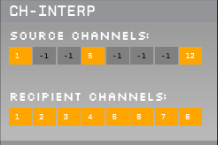

# Open Ephys channel interpolation plugin

This repository contains a plugin for the [Open Ephys GUI](https://github.com/open-ephys/plugin-GUI) to interpolate channels.

## Plugin configuration
The plugin receives 8 channels as input. You can use the `ChannelMap` plugin to select the channels.


- **Source Channels:** indicates the channels used as a source (>=0) and the desired interpolated ones (-1). Source channels (>=0) will be indicated in orange, whereas the ones that need to be interpolated must be indicated with a -1 (the box will turn grey).
- **Recipient Channels:** indicates the channels where the source channels will be saved (one to one mapping). 

## Compiling the plugin from source

1. Clone this repository in the same directory where [`plugin-GUI`](https://github.com/open-ephys/plugin-GUI) is located.
3. Go to the `Build` directory (<ch_interp_path>/Build/) and execute to create the CMake project:

For Linux:
```
cmake -G "Unix Makefiles" -DCMAKE_BUILD_TYPE=Release  ..
make
make install
```

For Windows:
```
cmake -G "Visual Studio 16 2019" -A x64 -DCMAKE_CXX_FLAGS="/EHsc /utf-8" ..
```
Open Visual Studio 16 2019 and compile and install the solution (see notes below on how to install Visual Studio).

## How to install Visual Studio 2019 and Open Ephys from source
1. Clone [Open Ephys GUI repository](https://github.com/open-ephys/plugin-GUI).

2. Download and install Visual Studio 2019.

3. Run `Resources/DLLs/FrontPanelUSB-DriverOnly-4.4.0.exe` to install DAQ drivers if needed.

4. Install C++ compiling tools for Visual Studio 2019 and create a new project so everything gets [properly configured](https://stackoverflow.com/questions/31619296/cmake-does-not-find-visual-c-compiler).

5. Download and install CMake. Select "Add CMake to the system PATH".

6. Add the line `add_definitions(-DWIN32)` into line 107 of CMakeLists.txt.

7. Open PowerShell, go to folder plugin-GUI/Build and run CMake. 

```
cmake -G "Visual Studio 16 2019" -A x64 -DCMAKE_CXX_FLAGS="/EHsc /utf-8" ..
```

`-A` indicates the target architecture, which must be specified accordingly.

8. Open `open-ephys-GUI.sln`, which can be found in the `Build` directory, with Visual Studio 2019.

9. Compile the solution.
